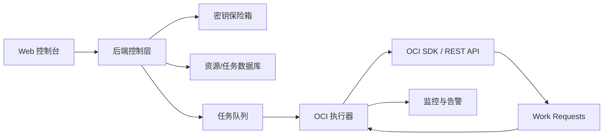
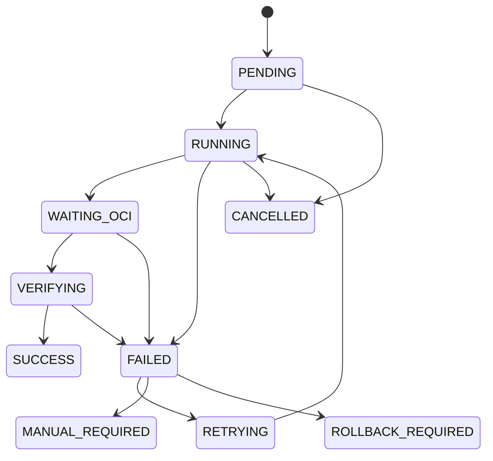

# OCI 机器生命周期控制平台产品设计文档

版本：V0.2  
适用阶段：产品方案评审、UI 设计对齐、技术实施拆分  
产品边界：仅面向 Oracle Cloud Infrastructure，不包含其它云厂商

## 1. 产品概述

本项目要建设的是一套 **OCI 机器生命周期控制平台**。

平台的核心价值不是简单封装几个 OCI API，而是把账号密钥、资源发现、实例创建、升降级、扩缩容、自动化、任务追踪、安全审批、审计日志统一成一套可长期运行的资源编排系统。

最终目标：

- 让用户可以安全地管理 OCI API Key。
- 让用户可以清晰查看 OCI 实例、模板、资源池、任务和审计。
- 让用户可以通过模板快速创建机器。
- 让用户可以对实例进行启动、停止、重启、删除、保留启动盘删除、升级、降级。
- 让用户可以通过资源池和自动化规则批量创建、扩容、缩容和回收机器。
- 让所有高风险和长耗时操作都进入任务系统，并可追踪、可重试、可审计。
- 让系统具备护栏，避免误删、误扩容、无限重试、密钥泄露和不可追踪操作。

## 2. 产品定位

### 2.1 一句话定位

面向 Oracle Cloud Infrastructure 的机器生命周期、安全审计和自动化编排控制平台。

### 2.2 用户价值

```text
过去：
用户手动配置 API Key，手动拼参数，手动创建机器，失败后难以追踪。

现在：
用户通过统一控制台选择 Profile、Region、Compartment 和模板，提交任务后由后端安全执行、持续追踪、失败可查、操作可审计。
```

### 2.3 设计关键词

- OCI 专用
- 安全密钥
- 任务驱动
- 模板创建
- 资源池管理
- 自动化规则
- 审计追踪
- 高风险护栏
- 可扩展架构

## 3. 产品边界

### 3.1 当前阶段包含

```text
OCI API Key / Profile 管理
OCI Region / Compartment 上下文管理
OCI Compute Instance 管理
OCI Shape / Image / VCN / Subnet / Boot Volume 等资源发现
实例创建 / 启动 / 停止 / 重启 / 删除
实例升级 / 降级
模板管理
资源池管理
自动化规则
任务中心
审计日志
用户权限
系统设置
```

### 3.2 当前阶段不包含

```text
AWS / Azure / Google Cloud / DigitalOcean 等其它云厂商
多云统一资源模型
跨云调度
跨云迁移
跨云账单
前端直连 OCI API
前端保存 API 私钥
无确认的高风险快捷操作
```

### 3.3 命名边界

为了避免项目污染，产品文案中统一使用 OCI 语义：

```text
账号：Profile
区域：Region
租户：Tenancy
用户：User
隔间：Compartment
实例：Instance
镜像：Image
规格：Shape
实例配置：Instance Configuration
实例池：Instance Pool
工作请求：Work Request
```

不使用：

```text
云账号统一模型
多云资源
云厂商切换
Provider
Cloud Account
Universal Instance
```

## 4. 总体架构



### 4.1 架构分层

```text
表现层
├─ Web 控制台
├─ 实例卡片 / 表格
├─ 创建向导
├─ 任务抽屉
└─ 审计与监控页面

控制层
├─ API Gateway / Backend API
├─ 用户权限校验
├─ 参数校验
├─ 风险校验
├─ 任务创建
└─ 审计记录

安全层
├─ API Key 加密存储
├─ 密钥读取权限控制
├─ Profile 状态检测
├─ 操作审批
└─ 敏感参数脱敏

编排层
├─ Job Service
├─ Queue
├─ Worker
├─ Scheduler
├─ Retry Policy
└─ Rollback Handler

OCI 执行层
├─ OCI SDK Client
├─ Compute Client
├─ Network Client
├─ Identity Client
├─ Monitoring Client
├─ Work Request Client
└─ Audit / Logging Client

数据层
├─ Profile
├─ Resource Snapshot
├─ Instance
├─ Template
├─ Resource Pool
├─ Automation Rule
├─ Job
└─ Audit Log
```

## 5. 核心设计原则

### 5.1 密钥不进浏览器

OCI API 私钥只允许存储在后端密钥模块中。前端只提交密钥录入请求，后续页面不展示私钥明文，也不返回完整密钥内容。

### 5.2 所有 OCI 修改操作都走任务

创建、删除、升降级、扩缩容、自动化执行都必须创建任务。

不允许前端点击后同步等待 OCI API 返回最终结果。

### 5.3 OCI 实时状态优先

数据库保存资源快照，用于查询、筛选、审计和任务关联。真正判断资源状态时，以 OCI 返回状态为准。

### 5.4 单机与资源池分层

单机管理用于少量实例和人工操作。批量创建、自动扩缩容、容量重试和回收优先通过模板与资源池完成。

### 5.5 自动化必须有护栏

每条自动化规则必须包含限制条件：

```text
最大实例数
最大 OCPU
最大内存
最大每日执行次数
冷却时间
失败重试上限
目标 Region 白名单
目标 Compartment 限制
危险动作审批要求
```

### 5.6 高风险操作必须可审计

删除、批量删除、释放公网 IP、删除启动盘、批量扩容、启用自动化、修改密钥等操作必须写入审计日志。

## 6. 用户角色

| 角色 | 主要职责 | 权限范围 |
| --- | --- | --- |
| 超级管理员 | 管理系统、密钥、用户、权限和所有资源 | 全部权限 |
| 运维管理员 | 管理实例、模板、资源池和自动化 | 不可查看私钥明文 |
| 普通操作员 | 日常启动、停止、重启、SSH | 不可删除实例，不可管理密钥 |
| 只读观察者 | 查看实例、任务和监控 | 只读 |
| 审计员 | 查看审计日志和任务记录 | 只读审计 |

## 7. 信息架构

```text
OCI 机器生命周期控制平台
├─ 概览 Dashboard
├─ 账号与密钥 Profiles
├─ 实例管理 Instances
├─ 创建实例 Create Instance
├─ 模板管理 Templates
├─ 资源池 Resource Pools
├─ 自动化规则 Automations
├─ 任务中心 Jobs
├─ 监控告警 Monitoring
├─ 用户与权限 Users & Roles
├─ 审计日志 Audit
└─ 系统设置 Settings
```

### 7.1 顶部全局上下文

顶部全局上下文影响所有页面。

```text
当前 Profile
当前 Region
当前 Compartment
当前同步状态
当前系统状态
```

推荐布局：

```text
Logo / 产品名称 | Profile | Region | Compartment | 同步状态 | 系统指标 | 设置 | 退出
```

### 7.2 左侧导航

```text
资源运营
├─ 概览
├─ 实例管理
├─ 创建实例
├─ 模板管理
├─ 资源池
└─ 自动化规则

平台治理
├─ 账号与密钥
├─ 任务中心
├─ 监控告警
├─ 审计日志
└─ 用户与权限

系统
└─ 系统设置
```

## 8. 功能模块设计

## 8.1 概览 Dashboard

### 8.1.1 页面目标

帮助用户快速判断当前 OCI 环境是否健康、资源是否异常、任务是否失败、自动化是否失控。

### 8.1.2 页面结构

```text
概览
├─ 全局状态卡片
│  ├─ Profile 状态
│  ├─ Region 状态
│  ├─ Compartment 状态
│  └─ 最近同步时间
│
├─ 资源统计
│  ├─ 实例总数
│  ├─ 运行中实例
│  ├─ 已停止实例
│  ├─ 异常实例
│  ├─ OCPU 使用量
│  └─ 内存使用量
│
├─ 任务状态
│  ├─ 正在执行
│  ├─ 等待 OCI
│  ├─ 成功
│  ├─ 失败
│  └─ 需要人工处理
│
├─ 风险提示
│  ├─ API Key 即将轮换
│  ├─ 自动化规则异常
│  ├─ 资源接近上限
│  ├─ 连续创建失败
│  └─ 审批待处理
│
└─ 最近操作
   ├─ 创建实例
   ├─ 删除实例
   ├─ 升降级
   ├─ 自动化触发
   └─ 密钥变更
```

### 8.1.3 核心交互

- 点击运行中实例数，跳转实例管理并自动筛选 `RUNNING`。
- 点击失败任务，跳转任务中心并自动筛选 `FAILED`。
- 点击风险提示，进入对应详情或设置页。
- 点击同步，创建资源同步任务。

## 8.2 账号与密钥 Profiles

### 8.2.1 页面目标

管理 OCI API Key、Profile、Region 和 Compartment 访问能力。

### 8.2.2 功能层级

```text
账号与密钥
├─ Profile 列表
│  ├─ 名称
│  ├─ Tenancy OCID
│  ├─ User OCID
│  ├─ Fingerprint
│  ├─ 默认 Region
│  ├─ 状态
│  ├─ 最近验证时间
│  └─ 操作
│
├─ 添加 Profile
│  ├─ 基础信息
│  ├─ API Key 信息
│  ├─ 默认 Region
│  ├─ 备注
│  └─ 连接测试
│
├─ Profile 详情
│  ├─ 基础信息
│  ├─ 可访问 Region
│  ├─ 可访问 Compartment
│  ├─ 权限检查结果
│  ├─ 关联资源
│  ├─ 关联任务
│  └─ 关联审计
│
└─ 密钥操作
   ├─ 测试连接
   ├─ 更新密钥
   ├─ 禁用 Profile
   ├─ 启用 Profile
   ├─ 轮换提醒
   └─ 删除 Profile
```

### 8.2.3 连接测试项目

```text
私钥格式检查
签名请求检查
Tenancy / User / Fingerprint 匹配检查
Region 可访问检查
Compartment 列表读取检查
Compute 只读权限检查
Shape / Image 列表读取检查
```

### 8.2.4 安全要求

- 私钥录入后不回显。
- 私钥必须加密存储。
- 禁用 Profile 后，关联自动化规则自动暂停。
- 删除 Profile 前必须检查是否存在未完成任务、资源池和自动化规则。

## 8.3 实例管理 Instances

### 8.3.1 页面目标

集中展示、筛选和操作 OCI Compute Instances。

### 8.3.2 页面结构

```text
实例管理
├─ 筛选区
│  ├─ Profile
│  ├─ Region
│  ├─ Compartment
│  ├─ 状态
│  ├─ Shape
│  ├─ 标签
│  ├─ 创建时间
│  └─ 名称 / IP / OCID
│
├─ 工具区
│  ├─ 同步
│  ├─ 创建实例
│  ├─ 批量操作
│  ├─ 卡片视图
│  └─ 表格视图
│
├─ 实例列表
│  ├─ 卡片视图
│  ├─ 表格视图
│  └─ 空状态
│
├─ 实例详情抽屉
│  ├─ 基础信息
│  ├─ 网络信息
│  ├─ 存储信息
│  ├─ 监控指标
│  ├─ 任务历史
│  ├─ 审计记录
│  └─ 危险操作区
│
└─ 操作反馈
   ├─ Toast
   ├─ 任务抽屉
   └─ 错误详情
```

### 8.3.3 实例卡片建议

```text
┌────────────────────────────────────┐
│ instance-20260608           RUNNING │
│ 公网 IP    152.69.228.112          │
│ 私网 IP    10.0.0.42               │
│ Shape     VM.Standard.A1.Flex      │
│ 规格       1 OCPU / 6 GB           │
│ 启动盘     100 GB                  │
│ Region    ap-singapore-1           │
│ 创建时间   2026-06-08 15:06        │
│                                    │
│ [SSH 连接]                         │
│ [关机] [重启] [升降级] [更多]       │
└────────────────────────────────────┘
```

### 8.3.4 单实例操作

```text
主操作
├─ SSH 连接
└─ SFTP

常用操作
├─ 启动
├─ 关机
├─ 重启
└─ 升级 / 降级

管理操作
├─ 重命名
├─ IP 管理
├─ 启动盘管理
├─ 标签管理
├─ 修复
└─ 重置镜像

危险操作
├─ 删除实例
└─ 删除实例并删除启动盘
```

### 8.3.5 批量操作

```text
批量启动
批量关机
批量重启
批量升降级
批量打标签
批量删除
```

批量危险操作需要二次确认，并展示影响实例数量。

## 8.4 创建实例 Create Instance

### 8.4.1 页面目标

用向导式流程降低 OCI 创建实例参数复杂度。

### 8.4.2 创建向导

```text
步骤 1：选择上下文
├─ Profile
├─ Region
└─ Compartment

步骤 2：选择创建方式
├─ 从模板创建
├─ 空白创建
├─ 从已有实例复制
└─ 从启动盘恢复

步骤 3：计算配置
├─ 实例名称
├─ 镜像 Image
├─ Shape
├─ OCPU
├─ 内存
└─ 创建数量

步骤 4：网络配置
├─ VCN
├─ Subnet
├─ 是否分配公网 IP
├─ NSG / Security List
└─ SSH 访问策略

步骤 5：存储与登录
├─ 启动盘大小
├─ 是否保留启动盘
├─ SSH 公钥
├─ 默认用户名
└─ cloud-init

步骤 6：策略与标签
├─ 项目标签
├─ 成本标签
├─ 过期时间
├─ 自动关机
├─ 失败重试
└─ 创建成功通知

步骤 7：预检查并提交
├─ API Key 检查
├─ 权限检查
├─ Shape 与 Image 兼容检查
├─ 服务限额检查
├─ 网络可用性检查
├─ 参数预览
└─ 创建任务
```

### 8.4.3 预检查结果

```text
通过：允许提交
警告：允许提交，但需要用户确认
失败：不允许提交，并展示修复建议
```

## 8.5 模板管理 Templates

### 8.5.1 页面目标

把常用创建参数沉淀为版本化模板，为手动创建和自动化创建提供基础。

### 8.5.2 功能层级

```text
模板管理
├─ 模板列表
├─ 创建模板
├─ 编辑模板
├─ 模板版本
├─ 从实例生成模板
├─ 从创建记录生成模板
├─ 使用模板创建实例
├─ 复制模板
├─ 禁用模板
└─ 删除模板
```

### 8.5.3 模板字段

```text
模板名称
模板版本
默认 Profile
默认 Region
默认 Compartment
Image OCID
Shape
OCPU
内存
VCN
Subnet
公网 IP 策略
启动盘大小
SSH 公钥
cloud-init
默认标签
默认失败策略
```

### 8.5.4 模板状态

```text
草稿
可用
已禁用
已归档
```

## 8.6 资源池 Resource Pools

### 8.6.1 页面目标

管理一组同类型实例，作为批量扩缩容和自动化创建的目标。

### 8.6.2 功能层级

```text
资源池
├─ 资源池列表
├─ 创建资源池
├─ 资源池详情
├─ 当前实例
├─ 目标数量
├─ 最小数量
├─ 最大数量
├─ 绑定模板
├─ 扩缩容历史
├─ 关联自动化规则
└─ 删除资源池
```

### 8.6.3 资源池关键字段

```text
资源池名称
绑定模板
Profile
Region
Compartment
当前数量
目标数量
最小数量
最大数量
冷却时间
缩容策略
状态
```

### 8.6.4 缩容策略

```text
优先删除最新实例
优先删除最旧实例
优先删除指定标签实例
手动选择实例
```

### 8.6.5 注意事项

- 删除资源池不应默认删除实例。
- 如果要同时删除实例，必须进入危险确认流程。
- 自动化规则必须绑定资源池。
- 资源池必须设置最大数量。

## 8.7 自动化规则 Automations

### 8.7.1 页面目标

让系统根据时间、指标、容量结果和资源状态自动执行实例操作。

### 8.7.2 规则类型

```text
定时规则
├─ 定时创建
├─ 定时启动
├─ 定时停止
└─ 定时缩容

指标规则
├─ CPU 高于阈值扩容
├─ CPU 低于阈值缩容
├─ 内存高于阈值扩容
├─ 网络流量高于阈值扩容
└─ 自定义指标触发

容量重试规则
├─ 指定 Shape 容量重试
├─ 多 Region 白名单重试
├─ 失败退避
└─ 最大尝试次数

异常修复规则
├─ 实例异常重启
├─ 实例停止后启动
├─ 创建失败后重试
└─ 健康检查失败后替换

过期回收规则
├─ 到期停止
├─ 到期删除
└─ 到期通知
```

### 8.7.3 规则编辑器

```text
基础信息
├─ 规则名称
├─ 规则类型
├─ 状态
└─ 描述

目标资源
├─ Profile
├─ Region
├─ Compartment
├─ 资源池
└─ 实例标签

触发条件
├─ 时间
├─ 指标
├─ 状态
├─ 容量结果
└─ 失败事件

执行动作
├─ 创建实例
├─ 扩容资源池
├─ 缩容资源池
├─ 启动实例
├─ 停止实例
├─ 重启实例
├─ 升级实例
├─ 降级实例
├─ 删除实例
└─ 发送通知

安全护栏
├─ 最大实例数
├─ 最大 OCPU
├─ 最大内存
├─ 最大每日执行次数
├─ 冷却时间
├─ 重试上限
├─ 超时时间
└─ 审批要求

失败处理
├─ 不重试
├─ 固定间隔重试
├─ 指数退避重试
├─ 暂停规则
└─ 通知管理员
```

## 8.8 任务中心 Jobs

### 8.8.1 页面目标

承载所有异步操作，提供状态追踪、日志查看、错误诊断、重试和审计关联。

### 8.8.2 任务类型

```text
创建实例
启动实例
停止实例
重启实例
删除实例
保留启动盘删除
升级 / 降级实例
IP 操作
模板操作
资源池扩容
资源池缩容
自动化执行
资源同步
连接测试
```

### 8.8.3 任务状态

```text
PENDING：等待执行
RUNNING：后端执行中
WAITING_OCI：等待 OCI 异步结果
VERIFYING：结果验证中
SUCCESS：成功
FAILED：失败
RETRYING：重试中
CANCELLED：已取消
ROLLBACK_REQUIRED：需要回滚
MANUAL_REQUIRED：需要人工处理
```

### 8.8.4 状态流



### 8.8.5 任务详情

```text
基础信息
├─ 任务 ID
├─ 任务类型
├─ 状态
├─ 操作人
├─ 创建时间
├─ 开始时间
└─ 结束时间

OCI 上下文
├─ Profile
├─ Tenancy OCID
├─ User OCID
├─ Region
├─ Compartment OCID
└─ Resource OCID

执行信息
├─ 请求参数
├─ OCI Request ID
├─ OCI Work Request ID
├─ 执行日志
├─ 错误信息
├─ 重试记录
└─ 关联审计
```

## 8.9 监控告警 Monitoring

### 8.9.1 页面目标

展示实例运行指标、资源池趋势、自动化触发依据和告警状态。

### 8.9.2 功能层级

```text
监控告警
├─ 实例指标
│  ├─ CPU
│  ├─ 内存
│  ├─ 网络入站
│  ├─ 网络出站
│  └─ 磁盘
│
├─ 资源池指标
│  ├─ 当前实例数
│  ├─ 目标实例数
│  ├─ 扩缩容次数
│  ├─ 创建成功率
│  └─ 创建失败率
│
├─ 告警规则
│  ├─ CPU 告警
│  ├─ 内存告警
│  ├─ 实例异常
│  ├─ 任务失败
│  └─ 自动化异常
│
└─ 通知记录
   ├─ 邮件
   ├─ Webhook
   └─ 系统通知
```

## 8.10 审计 Audit

### 8.10.1 页面目标

记录并查询系统内部操作和 OCI API 请求关联信息。

### 8.10.2 审计内容

```text
用户登录
用户退出
添加 Profile
更新 Profile
禁用 Profile
创建实例
启动 / 停止 / 重启
删除实例
升降级实例
创建模板
修改资源池
启用自动化
禁用自动化
任务重试
权限修改
系统设置修改
```

### 8.10.3 审计字段

```text
审计 ID
操作人
操作类型
资源类型
资源 ID
Profile
Region
Compartment
请求参数摘要
结果
OCI Request ID
OCI Work Request ID
IP 地址
User Agent
创建时间
```

## 8.11 用户与权限 Users & Roles

### 8.11.1 页面目标

控制系统内部用户能做什么，避免所有人都拥有密钥和删除权限。

### 8.11.2 权限矩阵

```text
查看实例
创建实例
启动实例
停止实例
重启实例
删除实例
升降级实例
管理模板
管理资源池
管理自动化
查看任务
重试任务
取消任务
管理 Profile
查看审计
导出审计
管理用户
管理系统设置
```

### 8.11.3 审批场景

```text
删除实例
删除启动盘
批量删除
批量扩容
超过 OCPU 阈值创建
启用自动化删除动作
修改密钥
修改系统安全设置
```

## 8.12 系统设置 Settings

### 8.12.1 功能层级

```text
系统设置
├─ 基础设置
│  ├─ 系统名称
│  ├─ 默认语言
│  ├─ 默认主题
│  └─ 默认分页
│
├─ 安全设置
│  ├─ 登录过期时间
│  ├─ 密钥加密方式
│  ├─ 操作二次确认
│  ├─ 审批开关
│  └─ 审计保留天数
│
├─ 任务设置
│  ├─ 默认超时时间
│  ├─ 默认重试次数
│  ├─ Work Request 轮询间隔
│  ├─ 最大并发任务
│  └─ 失败通知
│
├─ 自动化设置
│  ├─ 全局启停
│  ├─ 默认冷却时间
│  ├─ 最大每日执行次数
│  ├─ 最大实例创建数
│  └─ 默认失败策略
│
└─ 通知设置
   ├─ 邮件
   ├─ Webhook
   ├─ 任务失败通知
   └─ 自动化异常通知
```

## 9. 关键业务流程

## 9.1 添加 Profile 流程

```text
填写 Profile 信息
-> 上传 / 粘贴 Private Key
-> 后端加密保存
-> 执行连接测试
-> 读取 Region / Compartment
-> 执行 Compute 只读测试
-> 保存测试结果
-> Profile 可用
```

异常处理：

```text
密钥格式错误：不保存，提示修正
签名失败：保存为不可用状态，提示检查 Fingerprint / User OCID
权限不足：保存为受限状态，展示缺失权限
Region 不可用：允许保存，但默认不可选
```

## 9.2 创建实例流程

```text
选择 Profile / Region / Compartment
-> 选择模板或空白创建
-> 填写计算 / 网络 / 存储 / 登录参数
-> 执行预检查
-> 创建 Job
-> Worker 调用 LaunchInstance
-> 记录 OCI Request ID / Work Request ID
-> 轮询实例状态
-> 同步 IP / Shape / Boot Volume
-> 健康检查
-> Job 成功或失败
-> 写入审计日志
```

## 9.3 升级 / 降级流程

```text
选择实例
-> 点击升降级
-> 选择目标 Shape / OCPU / 内存
-> 检查 Image 与 Shape 兼容性
-> 检查服务限额
-> 检查容量可用性
-> 提示可能重启
-> 可选创建快照
-> 用户确认
-> 创建 Job
-> 调用 UpdateInstance
-> 等待完成
-> 验证实例状态
-> 写入审计日志
```

回滚策略：

```text
如果升级后实例无法进入 RUNNING：
├─ 尝试恢复原 Shape
├─ 如果恢复失败，标记 ROLLBACK_REQUIRED
└─ 通知管理员人工处理
```

## 9.4 删除实例流程

```text
选择实例
-> 进入更多菜单
-> 选择删除
-> 选择是否保留启动盘
-> 展示风险提示
-> 输入实例名称确认
-> 创建 Job
-> 调用 TerminateInstance
-> 轮询状态
-> 同步资源
-> 写入审计日志
```

## 9.5 自动扩容流程

```text
监控指标或定时规则触发
-> 策略引擎读取规则
-> 检查资源池上限
-> 检查冷却时间
-> 检查每日执行次数
-> 检查 Profile 状态
-> 基于模板生成创建参数
-> 创建 Job
-> 执行创建
-> 成功后加入资源池
-> 失败后按规则重试或暂停
-> 写入审计与自动化历史
```

## 9.6 容量重试流程

```text
规则触发
-> 读取 Shape / Region 白名单
-> 检查当前资源池数量
-> 检查重试次数
-> 检查退避时间
-> 尝试创建
-> 如果容量不足，记录原因
-> 切换下一个 Region 或等待下一轮
-> 达到上限后暂停规则并通知
```

注意：

- 容量重试不能无间隔刷 API。
- 必须设置最大尝试次数。
- 必须支持一键暂停。
- 必须保留每次失败原因。

## 10. 数据模型草案

### 10.1 Profile

```text
id
name
tenancy_ocid
user_ocid
fingerprint
private_key_encrypted
passphrase_encrypted
default_region
status
permission_summary
last_checked_at
created_by
created_at
updated_at
```

### 10.2 Compartment

```text
id
profile_id
compartment_ocid
name
description
lifecycle_state
parent_compartment_ocid
synced_at
```

### 10.3 Instance

```text
id
profile_id
region
compartment_ocid
instance_ocid
display_name
lifecycle_state
availability_domain
fault_domain
shape
ocpus
memory_gb
image_ocid
public_ip
private_ip
boot_volume_ocid
boot_volume_size_gb
tags
created_at_oci
synced_at
```

### 10.4 Template

```text
id
name
version
profile_id
region
compartment_ocid
image_ocid
shape
ocpus
memory_gb
vcn_ocid
subnet_ocid
assign_public_ip
boot_volume_size_gb
ssh_public_key_ref
cloud_init
tags
status
created_by
created_at
updated_at
```

### 10.5 ResourcePool

```text
id
name
template_id
profile_id
region
compartment_ocid
desired_size
min_size
max_size
current_size
cooldown_seconds
scale_in_policy
status
created_by
created_at
updated_at
```

### 10.6 AutomationRule

```text
id
name
type
target_type
target_id
trigger_config
action_config
guardrail_config
failure_policy
enabled
last_run_at
next_run_at
created_by
created_at
updated_at
```

### 10.7 Job

```text
id
type
status
profile_id
region
compartment_ocid
resource_type
resource_id
input_payload
result_payload
oci_request_id
oci_work_request_id
error_code
error_message
retry_count
max_retries
created_by
created_at
started_at
finished_at
```

### 10.8 AuditLog

```text
id
actor_id
action
resource_type
resource_id
profile_id
region
compartment_ocid
job_id
oci_request_id
oci_work_request_id
request_summary
result
ip_address
user_agent
created_at
```

## 11. 后端服务框架

```text
Auth Service
├─ 登录
├─ 会话
└─ 权限校验

Profile Service
├─ Profile CRUD
├─ 密钥加密
├─ 连接测试
└─ 权限检查

Resource Sync Service
├─ 同步 Region
├─ 同步 Compartment
├─ 同步 Instance
├─ 同步 Image / Shape
└─ 同步 Network / Volume

Instance Service
├─ 创建实例参数校验
├─ 单实例操作
├─ 批量操作
├─ 升降级
└─ 删除策略

Template Service
├─ 模板 CRUD
├─ 模板版本
├─ 从实例生成
└─ 参数渲染

Pool Service
├─ 资源池 CRUD
├─ 扩容
├─ 缩容
└─ 实例归属管理

Automation Service
├─ 规则 CRUD
├─ 触发器
├─ 策略判断
├─ 护栏校验
└─ 执行历史

Job Service
├─ 创建任务
├─ 状态流转
├─ 重试
├─ 取消
└─ 错误记录

OCI Executor
├─ OCI Client Factory
├─ Compute Actions
├─ Network Actions
├─ Work Request Polling
└─ Result Verification

Audit Service
├─ 系统审计
├─ OCI 请求关联
└─ 导出
```

## 12. API 框架草案

### 12.1 Profile APIs

```text
GET    /api/profiles
POST   /api/profiles
GET    /api/profiles/{id}
PATCH  /api/profiles/{id}
POST   /api/profiles/{id}/test
POST   /api/profiles/{id}/disable
POST   /api/profiles/{id}/enable
DELETE /api/profiles/{id}
```

### 12.2 Instance APIs

```text
GET    /api/instances
GET    /api/instances/{id}
POST   /api/instances/launch
POST   /api/instances/{id}/start
POST   /api/instances/{id}/stop
POST   /api/instances/{id}/reboot
POST   /api/instances/{id}/resize
POST   /api/instances/{id}/terminate
POST   /api/instances/batch
POST   /api/instances/sync
```

### 12.3 Template APIs

当前已实现的模板接口只用于保存创建实例表单预输入，不调用 OCI API，也不需要密钥验证：

```text
GET    /api/templates
POST   /api/templates
GET    /api/templates/{id}
PATCH  /api/templates/{id}
DELETE /api/templates/{id}
POST   /api/templates/{id}/validate
```

后续可扩展接口：

```text
GET    /api/templates/{id}/versions
POST   /api/templates/{id}/versions
POST   /api/templates/from-instance/{instanceId}
POST   /api/templates/from-job/{jobId}
```

### 12.4 Pool APIs

```text
GET    /api/pools
POST   /api/pools
GET    /api/pools/{id}
PATCH  /api/pools/{id}
POST   /api/pools/{id}/scale
POST   /api/pools/{id}/pause
POST   /api/pools/{id}/resume
DELETE /api/pools/{id}
```

### 12.5 Automation APIs

```text
GET    /api/automations
POST   /api/automations
GET    /api/automations/{id}
PATCH  /api/automations/{id}
POST   /api/automations/{id}/enable
POST   /api/automations/{id}/disable
POST   /api/automations/{id}/run-once
DELETE /api/automations/{id}
```

### 12.6 Job APIs

```text
GET    /api/jobs
GET    /api/jobs/{id}
POST   /api/jobs/{id}/retry
POST   /api/jobs/{id}/cancel
GET    /api/jobs/{id}/logs
```

### 12.7 Audit APIs

```text
GET    /api/audit-logs
GET    /api/audit-logs/{id}
POST   /api/audit-logs/export
```

## 13. UI 页面框架

### 13.1 通用页面结构

```text
页面标题
├─ 当前上下文
├─ 主操作按钮
├─ 筛选区
├─ 数据展示区
├─ 详情抽屉
├─ 操作弹窗
└─ 任务反馈
```

### 13.2 通用组件

```text
ProfileSelector
RegionSelector
CompartmentSelector
StatusBadge
RiskBadge
JobDrawer
ConfirmDangerModal
ResourceCard
ResourceTable
FilterBar
AuditTimeline
MetricChart
EmptyState
ErrorPanel
```

### 13.3 操作反馈规范

```text
同步类轻操作：Toast
异步类资源操作：创建 Job 并打开任务抽屉
失败类操作：任务抽屉展示错误详情
危险类操作：确认弹窗 + 输入确认文本
批量危险操作：展示影响范围 + 输入确认文本
```

## 14. 安全与审计设计

### 14.1 密钥安全

```text
私钥加密存储
私钥不回显
前端不缓存私钥
密钥使用过程不写入普通日志
Profile 禁用后不可创建新任务
密钥轮换记录写入审计
```

### 14.2 权限安全

```text
系统内部 RBAC
OCI IAM 最小权限建议
高风险操作审批
危险动作二次确认
自动化规则护栏
批量操作限制
```

### 14.3 审计安全

```text
所有修改操作写审计
所有 OCI Request ID 关联任务
所有失败保留错误详情
审计日志只读
审计导出需要权限
```

## 15. 可回滚设计

### 15.1 可自动回滚

```text
升降级失败后尝试恢复原 Shape
自动化创建失败后释放半成品资源
资源池扩容部分失败后修正目标数量
模板发布失败后保留旧版本
```

### 15.2 需要人工处理

```text
实例进入异常状态且无法恢复
删除操作已完成
启动盘被删除
OCI 返回权限或容量异常
Work Request 长时间无结果
```

### 15.3 UI 表达

```text
SUCCESS：已完成
FAILED：失败，可查看错误
ROLLBACK_REQUIRED：需要回滚
MANUAL_REQUIRED：需要人工处理
PARTIAL_SUCCESS：部分成功
```

## 16. 技术栈建议

### 16.1 推荐组合

```text
前端：React / Next.js
UI：Ant Design 或 shadcn/ui
后端：Python FastAPI + OCI Python SDK
任务队列：Celery / RQ + Redis
数据库：PostgreSQL
缓存：Redis
密钥：OCI Vault 或本地 KMS 封装
部署：Docker Compose 起步，后续拆分 API / Worker / Scheduler / Frontend
```

### 16.2 备选组合

```text
后端：Node.js NestJS + OCI SDK
任务队列：BullMQ + Redis
数据库：PostgreSQL
```

## 17. 版本阶段规划

### 17.1 MVP

```text
账号与密钥
Profile 连接测试
实例列表
创建实例
启动 / 停止 / 重启
删除 / 保留启动盘删除
任务中心
基础审计
```

交付标准：

```text
能添加 OCI Profile
能同步实例
能创建实例
能执行实例生命周期操作
能查看任务结果
能追踪失败原因
```

### 17.2 第二阶段

```text
模板管理
升降级
批量操作
实例详情抽屉
服务限额检查
Shape / Image 兼容检查
更完整审计
```

### 17.3 第三阶段

```text
资源池
自动化规则
定时创建 / 停止
容量重试
失败重试策略
监控告警
```

### 17.4 第四阶段

```text
用户权限
审批流
密钥轮换提醒
Webhook
报表导出
Open API
```

## 18. 与 UI 设计对齐的重点

后续拿到 UI 设计稿后，需要重点检查以下内容：

```text
顶部是否清晰展示 Profile / Region / Compartment
是否已移除其它云厂商入口
实例卡片按钮是否过密
危险操作是否被弱化为二级入口
创建实例是否采用向导式流程
任务中心是否足够突出
自动化规则是否有护栏表达
资源池和模板是否有关联路径
失败状态是否能看到 OCI 原始错误
审计入口是否容易发现
移动端或小屏是否存在按钮拥挤
```

## 19. 待确认问题

这些问题建议在 UI 设计稿到来后一并确认：

```text
系统是否只允许管理员添加 Profile？
是否需要多用户登录？
MVP 是否需要审批流，还是只保留危险确认？
是否优先支持单 Region，还是 MVP 就支持多 Region？
是否需要对接 OCI Vault，还是先本地加密存储？
是否需要完整 Instance Pool，还是先做内部 Resource Pool？
自动化容量重试的最短间隔是多少？
删除实例是否默认保留启动盘？
是否需要支持 cloud-init 模板库？
是否需要内置 SSH Web Terminal？
```

## 20. 官方能力参考

产品能力基于以下 OCI 官方能力设计：

```text
API Signing Key / Required Keys and OCIDs
Compute LaunchInstance
Compute InstanceAction
Compute UpdateInstance
Compute TerminateInstance
Instance Configuration
Instance Pool
Autoscaling
Work Requests
IAM Policies
Monitoring Metrics and Alarms
Audit Logs
```

参考链接：

- https://docs.oracle.com/iaas/Content/API/Concepts/apisigningkey.htm
- https://docs.oracle.com/iaas/Content/Compute/Tasks/launchinginstance.htm
- https://docs.oracle.com/en-us/iaas/Content/Compute/Tasks/resizinginstances.htm
- https://docs.oracle.com/en-us/iaas/Content/Compute/Concepts/instance-pools.htm
- https://docs.oracle.com/iaas/Content/Compute/Tasks/autoscalinginstancepools.htm
- https://docs.oracle.com/iaas/Content/General/Concepts/workrequestoverview.htm
- https://docs.oracle.com/en-us/iaas/Content/Security/Reference/iam_security_topic-IAM_Security_Policies.htm
- https://docs.oracle.com/en-us/iaas/Content/Monitoring/Concepts/monitoringoverview.htm
- https://docs.oracle.com/iaas/Content/GSG/Tasks/usingaudit.htm
